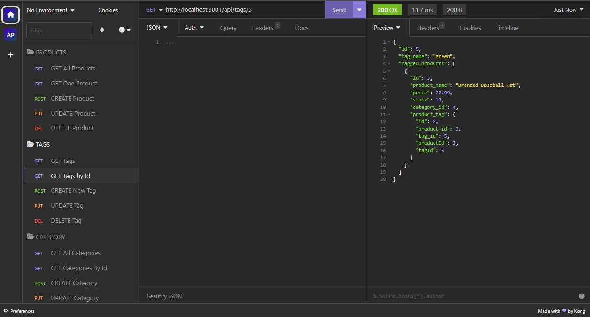
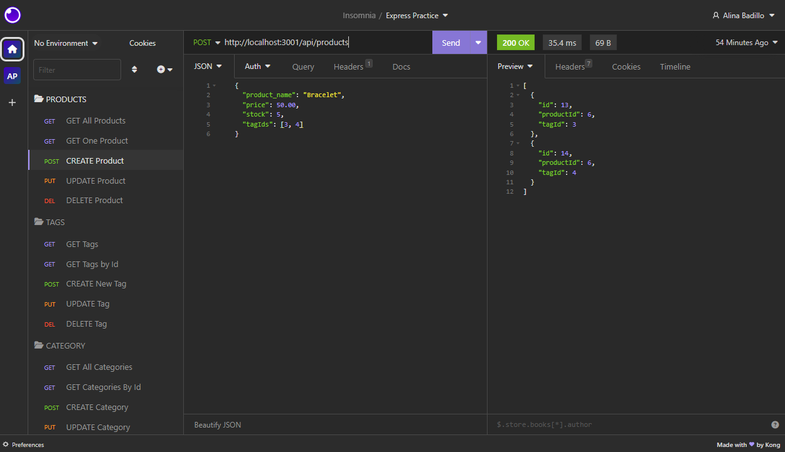
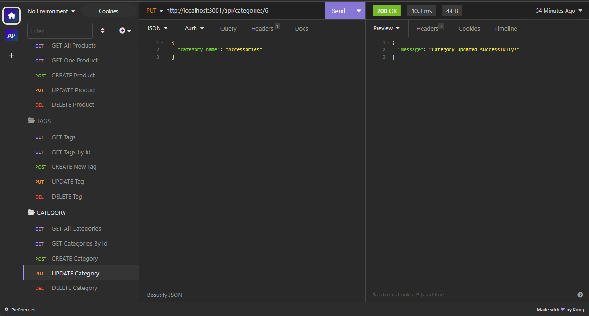

# E-Commerce Website(SQL)

[](https://opensource.org/licenses/MIT)

## Description
Back end e-commerce website which uses Express.js for the server and Sequelize to interact with a MySQL database. 

This app uses a RESTful API that works with categories, products, tags and product tags. 

Users can perform CRUD operations on the database models to view, create, update and delete information.

## Table of Contents
- [Installation](#installation)
- [Usage](#usage)
- [Contributing](#contributing)
- [Credits](#credits)
- [License](#license)
- [Questions](#questions)

## Installation
Clone the repository.
```
git clone git@github.com:AlinaB108/e-commerce-site.git
```
Create package.json:
```
npm init -y
```
Install all dependencies from package.json:
```
npm i
```
The app uses dotenv (you need to use your own sql password)
```
npm i dotenv 
```

## Usage
[Recording of Application](https://watch.screencastify.com/v/k61vl3SUU1G1Z7RAWsD2)

Start mySQL in an integrated terminal
```
mysql -u root -p
```
Then execute SQL statements from a file
```
SOURCE ./db/schema.sql
```
Quit MySQL and then seed the database
```
node ./seeds/index.js
```
Start the server
```
node server.js
```
To check the API routes you will need Insomnia or an app with similar functionality (e.g. Postman).

Example of CRUD Operations in Insomnia:








## Contributing
1. Fork the project by clicking Fork in the top-right corner of the page.
2. Clone the repository.
3. Create a new branch to work on.
4. Commit the changes.
5. Push to the branch.
6. Create a pull request.

## Credits
Starter code is provided by UT Coding Bootcamp

## License
[](https://opensource.org/licenses/MIT)

https://opensource.org/licenses/MIT 
    
## Questions
If you have any questions, send me a message [GitHub](https://github.com/AlinaB108) or send me an email: [alinachristabel108@gmail.com](alinachristabel108@gmail.com)